# User Manual AI Streamer
## Daftar Isi
- [User Manual AI Streamer](#user-manual-ai-streamer)
  - [Daftar Isi](#daftar-isi)
- [Installasi Sistem](#installasi-sistem)
  - [Kebutuhan Hardware](#kebutuhan-hardware)
  - [Kebutuhan Software](#kebutuhan-software)
    - [Kebutuhan untuk laptop](#kebutuhan-untuk-laptop)
    - [Kebutuhan untuk Mini PC](#kebutuhan-untuk-mini-pc)
  - [Langkah Installasi](#langkah-installasi)
    - [1. Pra-installasi](#1-pra-installasi)
    - [2. Installasi Dashboard](#2-installasi-dashboard)
      - [2.1. Installasi Langsung di Mini PC](#21-installasi-langsung-di-mini-pc)
      - [2.2. Installasi Menggunakan Laptop](#22-installasi-menggunakan-laptop)
    - [3. Mendaftarkan Data Perangkat](#3-mendaftarkan-data-perangkat)
    - [4. Mendaftarkan Data Kamera](#4-mendaftarkan-data-kamera)
    - [5. Mengaktikan semua program AI](#5-mengaktikan-semua-program-ai)
      - [5.1. Aktivasi Langsung dari Mini PC](#51-aktivasi-langsung-dari-mini-pc)
      - [5.2. Aktivasi Menggunakan Laptop](#52-aktivasi-menggunakan-laptop)
- [Penggunaan Dashboard AI Streamer](#penggunaan-dashboard-ai-streamer)
  - [Monitoring](#monitoring)
    - [Halaman Awal](#halaman-awal)
    - [Halaman kamera](#halaman-kamera)
    - [Halaman Chart](#halaman-chart)
    - [Unduh Laporan](#unduh-laporan)
  - [Mengelola Data](#mengelola-data)
    - [Mengubah Pengaturan Perangkat](#mengubah-pengaturan-perangkat)
    - [Menghapus Data Perangkat ⚠️](#menghapus-data-perangkat-️)
    - [Mengubah Pengaturan Kamera](#mengubah-pengaturan-kamera)
    - [Menghapus Data Kamera ⚠️](#menghapus-data-kamera-️)
- [Fungsi Tingkat Lanjut](#fungsi-tingkat-lanjut)
  - [Melihat Daftar Service Perangkat](#melihat-daftar-service-perangkat)
  - [Monitoring Kinerja Perangkat Mini PC Jetson](#monitoring-kinerja-perangkat-mini-pc-jetson)
  - [Menghapus Installasi Sistem ⚠️](#menghapus-installasi-sistem-️)


# Installasi Sistem

## Kebutuhan Hardware
- Mini PC Jetson Orin NX
- Laptop / PC windows 11
- Monitor HDMI
- Keyboard & mouse USB
- Jaringan LAN

## Kebutuhan Software
### Kebutuhan untuk laptop
   - Windows 11 (direkomendasikan)
   - putty (untuk akses SSH, jika tidak menggunakan windows 11)
   - FileZilla
   - File `aicounter.zip`
### Kebutuhan untuk Mini PC
   - Ubuntu Default jetson Orin NX

## Langkah Installasi
### 1. Pra-installasi
- Koneksikan mini PC jetson orin NX dengan monitor, keyboard dan mouse
- Koneksikan mini PC ke jaringan LAN menggunakan port LAN2
  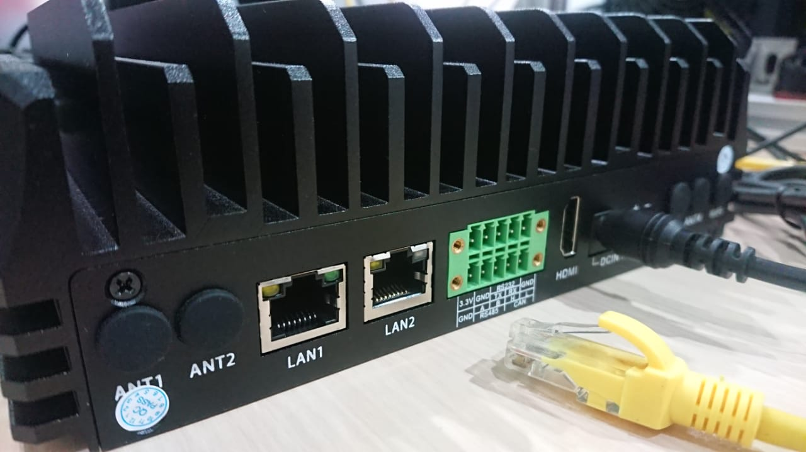
  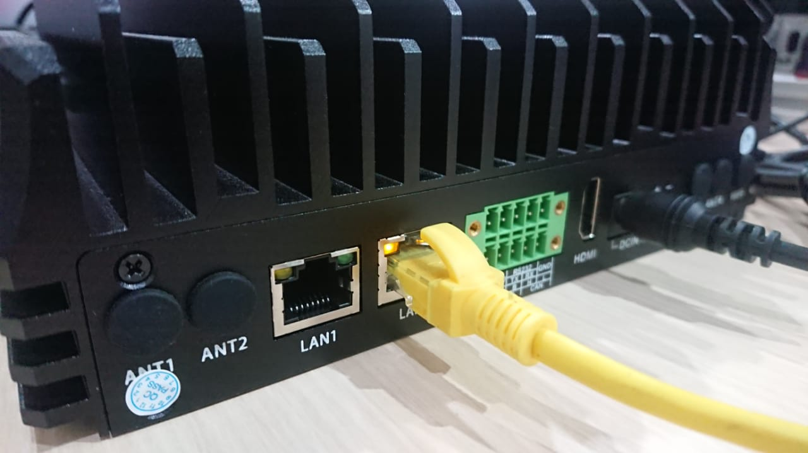
- Nyalakan mini PC dengan men-koneksikan kabel power
- Pada halaman login, ketikan password `123456` dan tunggu hingga masuk ke tampilan desktop
  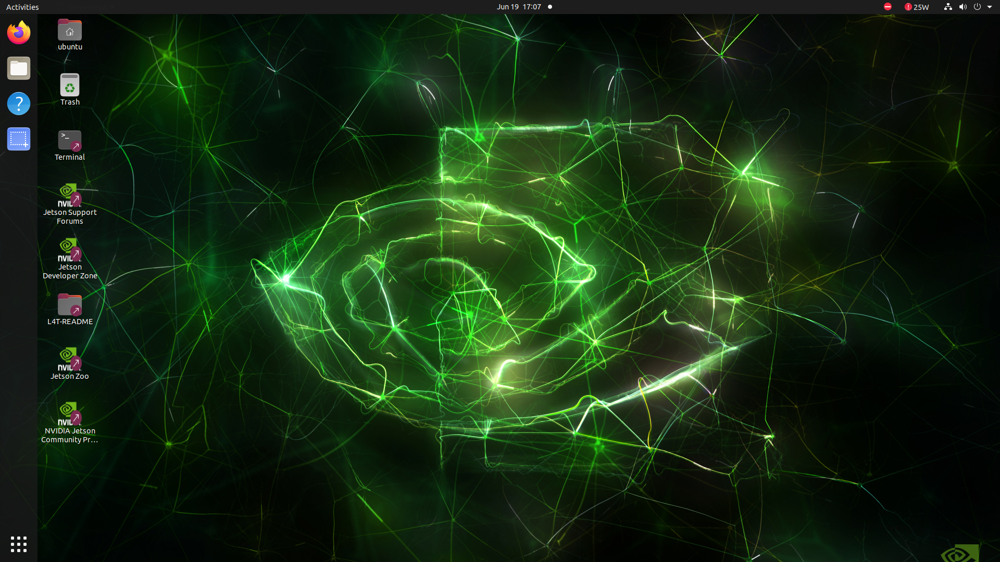
- Klik icon network di pojok kanan atas tampilan desktop, lalu klik `Ethernet (eth0)...`, lalu klik `Wired Settings`
  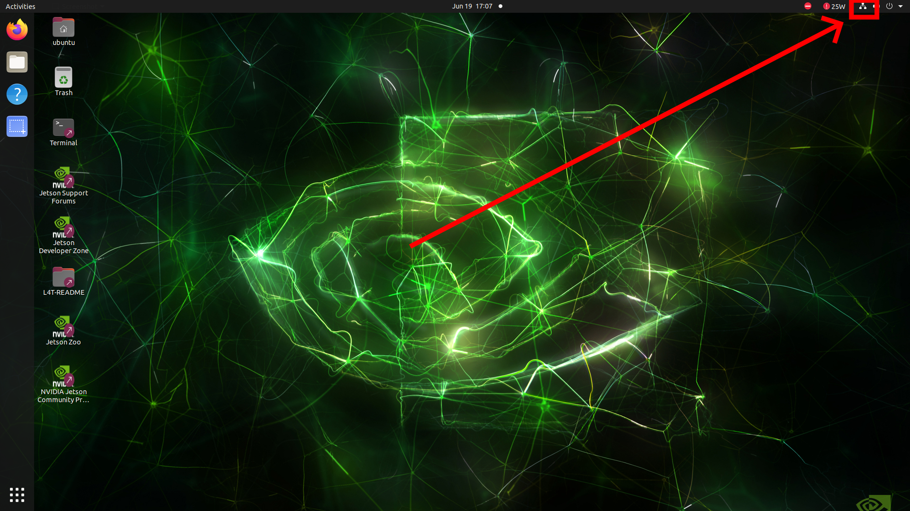
  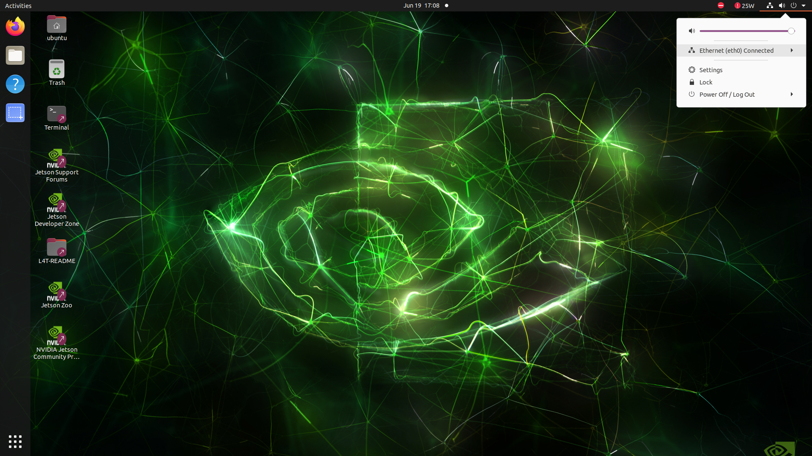
  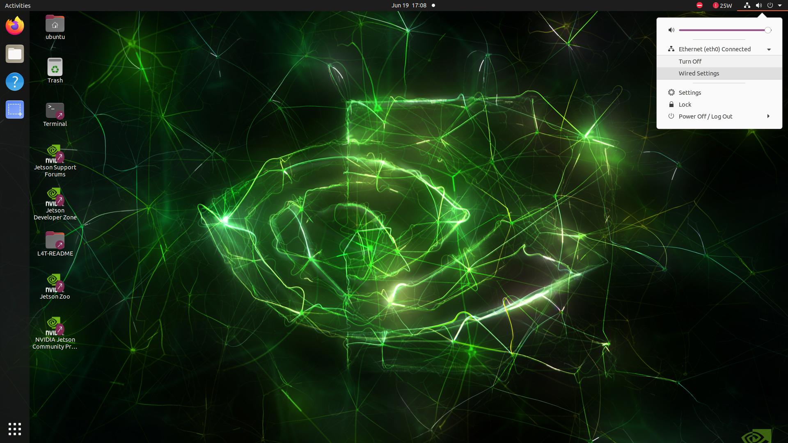
- Pada tampilan setting `network`, klik logo roda gigi di bagian `Ethernet (eth0)`
  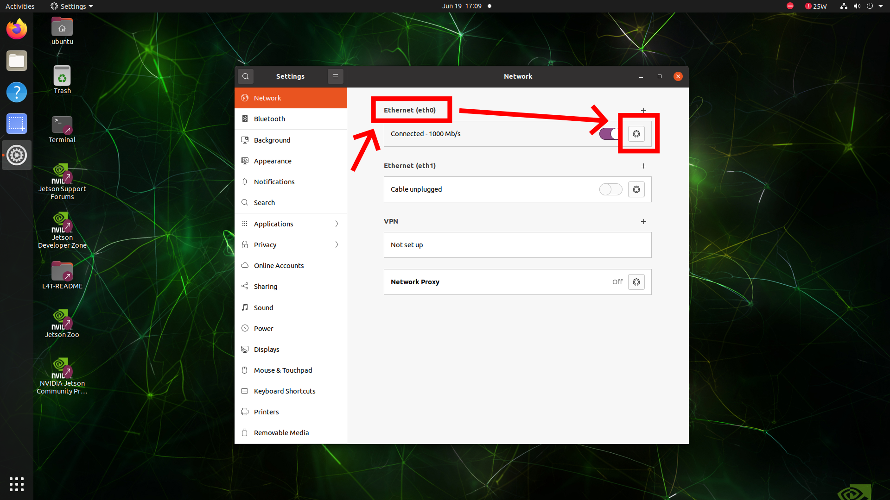
- Pada tampilan setting `wired`, klik pada tab `IPv4`
  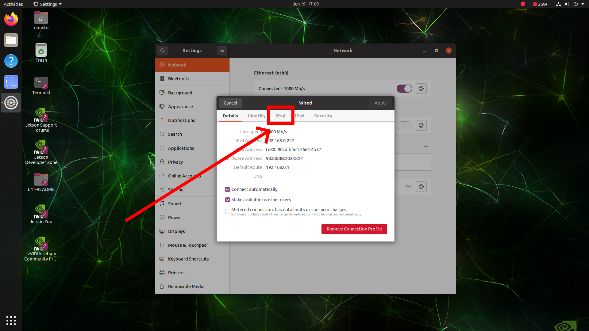
- Pilih mode `Manual` pada bagian `IPv4 Method`, lalu isikan IP address pada bagian `Address`, Netmask pada isian `Netmask`, dan IP Gateway pada isian `Gateway`. Lalu klik tombol `Apply`
  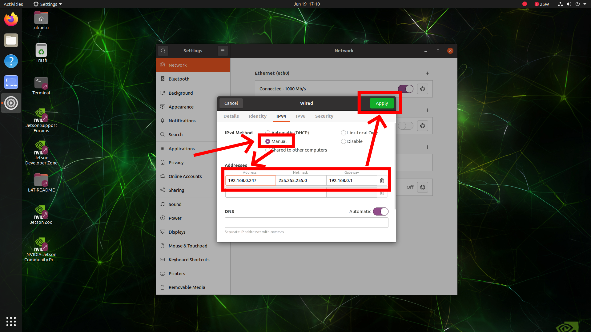
- Setelah selesai tutup tampilan setting, dan restart mini PC dengan men-klik logo power di pojok kanan atas tampilan desktop, lalu klik `Power Off/Log Out` lalu pilih restart
  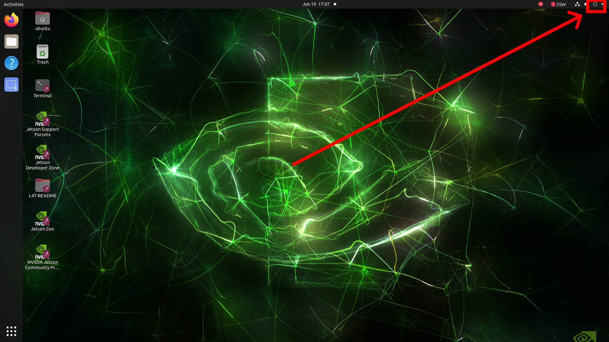
  
  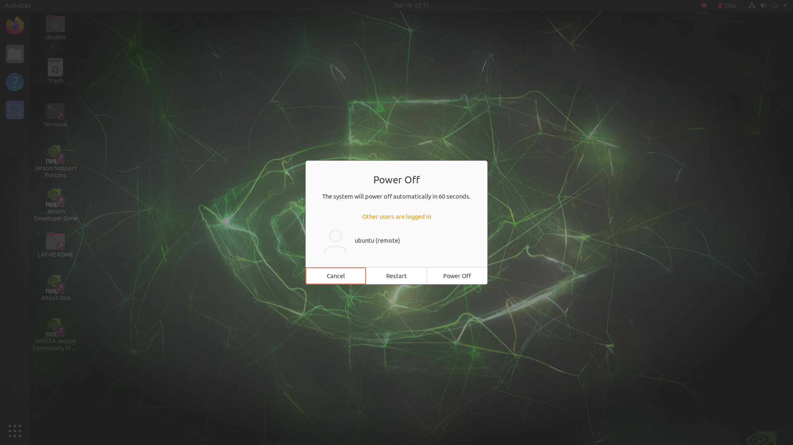
- Siapkan file installasi di mini PC. langkah ini dapat dilakukan dengan dua cara:
    - **Pilihan 1:** Dengan aplikasi FileZilla:
        - Setelah mini PC kembali menyala, buka file `aicounter.zip` di laptop, kemudian extract file tersebut hingga ada folder `aicounter`
        - Buka aplikasi FileZilla
        - Buat Koneksi baru dengan mengisikan isian `host` sesuai IP yang telah ditentukan, kemudian isikan `username` dengan `ubuntu`, bagian `password` diisikan `123456` dan `port` diisi `21` lalu klik `quick connect`
        - Pada panel bagian kanan atas klik folder `home` lalu klik folder `ubuntu`
        - Pada panel bagian kiri atas, pilih lokasi tempat folder `aicounter` berada
        - Drag and drop folder aicounter pada panel bagian kiri bawah ke panel kanan bawah untuk meng-upload folder tersebut ke mini PC.
    - **Pilihan 2:** Dengan media penyimpanan portabel:
        - Siapkan media penyimpanan portabel seperti flashdisk atau hard disk eksternal, isikan file `aicounter.zip`, lalu extract file tersebut hingga ada folder `aicounter`
        - Pasangkan media penyimpanan tersebut ke mini PC, lalu salin folder `aicounter` ke folder `home/ubuntu/`
### 2. Installasi Dashboard
installasi dapat dilakukan dengan langsung mengakses mini PC, atau menggunakan koneksi LAN di laptop
#### 2.1. Installasi Langsung di Mini PC
- Pada tampilan desktop, double klik logo `Terminal` untuk membuka aplikasi tersebut.
- Ketikkan perintah berikut lalu tekan `enter`:
  ```bash
  cd /home/ubuntu/
  chmod +x *.sh
  chmod +x */*.sh
  ./install.sh
  ```
- Tunggu hingga proses selesai, kemudian tekan dan tahan tombol `ctrl` di keyboard, sambil klik link yang ditampilkan pada teks terminal hingga aplikasi dashboard AI terbuka 
#### 2.2. Installasi Menggunakan Laptop
- Buka aplikasi terminal
- Ketikkan perintah berikut dan tekan `enter`: `(misal ip perangkat adalah: 192.168.0.247)`
  ```[bash]
  ssh ubuntu@192.168.0.247
  ```
- Kemudian ketikkan password `123456` ketika terdapat tulisan `password:` di layar lalu tekan `enter`
- setelah memasukkan password, ketikkan perintah berikut lalu tekan `enter`:
  ```bash
  chmod +x *.sh
  chmod +x */*.sh
  ./install.sh
  ```
- Tunggu hingga proses selesai, kemudian tekan dan tahan tombol `ctrl` di keyboard, sambil klik link yang ditampilkan pada teks terminal hingga aplikasi dashboard AI terbuka 
### 3. Mendaftarkan Data Perangkat
- Buka browser di mini PC atau di laptop yang terkoneksi jaringan LAN yang sama dengan mini PC, lalu ketikkan alamat IP mini PC pada browser. `contoh: http://192.168.0.247/`
- Klik tombol `+` di pojok kanan atas halaman web untuk menambahkan data perangkat baru
- Pada halaman formulir, isikan identitas perangkat berikut lalu klik `simpan`
  
  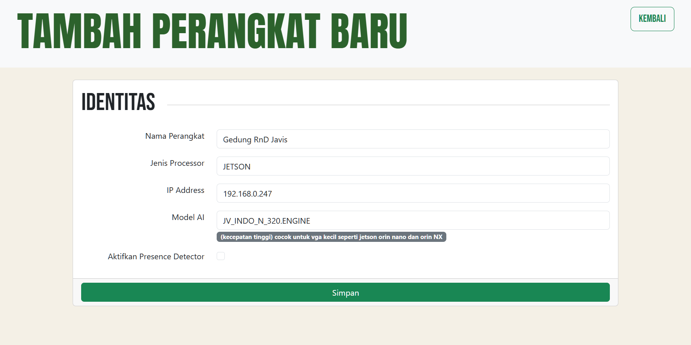

  | Form | Keterangan |
  |---|---|
  | Nama Perangkat | Nama untuk identitas perangkat (contoh: **AI 1 simpang Maguwo**) |
  | Jenis Processor | Jenis processor untuk menjalankan program AI <table><thead><tr><th>Processor</th><th>Keterangan</th></tr></thead><tbody><tr><td>CPU</td><td>Untuk Menjalankan program AI di PC, laptop, server, atau mini PC yang <b>tidak memiliki VGA Nvidia</b></td></tr><tr><td>GPU</td><td>Untuk Menjalankan program AI di PC, laptop, server, atau mini PC yang <b>memiliki VGA Nvidia</b> dan mendukung runtime CUDA</td></tr><tr><td>JETSON</td><td>Untuk perangkat mini PC seri Nvidia Jetson <b>(Direkomendasikan pilih opsi ini)</b></td></tr></tbody></table>|
  | IP Address | Alamat IP mini PC yang telah ditentukan sebelumnya  |
  | Model AI | Model AI yang akan digunakan *(direkmondasikan untuk memilih **JV_INDO_N_320.ENGGINE**)* |
  | Atifkan Presence Detector | Untuk menyalakan fungsi Presence Detector jika perangkat akan dipasang di kamera simpang |
  | IP Server Directs | IP Server MQTT untuk aplikasi `Directs` |
  | Treshold Gap Kendaraan | Batas berpa detik jarak waktu tiap kendaraan menyentuh garis deteksi antara satu kendaraan ke kendaraan berikutnya untuk dinyatakan ramai |


### 4. Mendaftarkan Data Kamera
- Buka browser di mini PC atau di laptop yang terkoneksi jaringan LAN yang sama dengan mini PC, lalu ketikkan alamat IP mini PC pada browser. `contoh: http://192.168.0.247/`
- Klik tombol `tambah kamera` di pojok kanan atas nama perangkat pada halaman web untuk menambahkan data kamera baru
  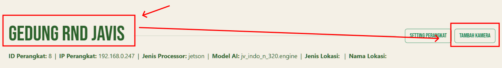
- Pada halaman formulir, isikan identitas kamera berikut lalu klik `simpan`
### 5. Mengaktikan semua program AI
#### 5.1. Aktivasi Langsung dari Mini PC
- Pada tampilan desktop, double klik logo `Terminal` untuk membuka aplikasi tersebut.
- Ketikkan perintah berikut lalu tekan `enter`:
  ```bash
  cd /home/ubuntu/aicounter
  ./activate_ai.sh
  ```
#### 5.2. Aktivasi Menggunakan Laptop
- Buka aplikasi terminal
- Ketikkan perintah berikut dan tekan `enter`: `(misal ip perangkat adalah: 192.168.0.247)`
  ```[bash]
  ssh ubuntu@192.168.0.247
  ```
- Kemudian ketikkan password `123456` ketika terdapat tulisan `password:` di layar lalu tekan `enter`
- Ketikkan perintah berikut lalu tekan `enter`:
  ```bash
  cd /aicounter
  ./activate_ai.sh
  ```


# Penggunaan Dashboard AI Streamer

## Monitoring

### Halaman Awal
- Buka browser di mini PC atau di laptop yang terkoneksi jaringan LAN yang sama dengan mini PC, lalu ketikkan alamat IP mini PC pada browser. `contoh: http://192.168.0.247/`
  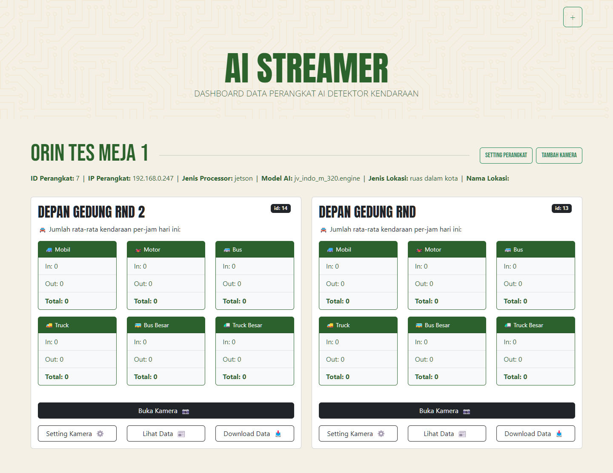
### Halaman kamera
- Buka browser di mini PC atau di laptop yang terkoneksi jaringan LAN yang sama dengan mini PC, lalu ketikkan alamat IP mini PC pada browser. `contoh: http://192.168.0.247/`
- Klik tombol `Buka Kamera` pada daftar Kamera
  
- Akan muncul halaman monitoring kamera sebagai berikut:
  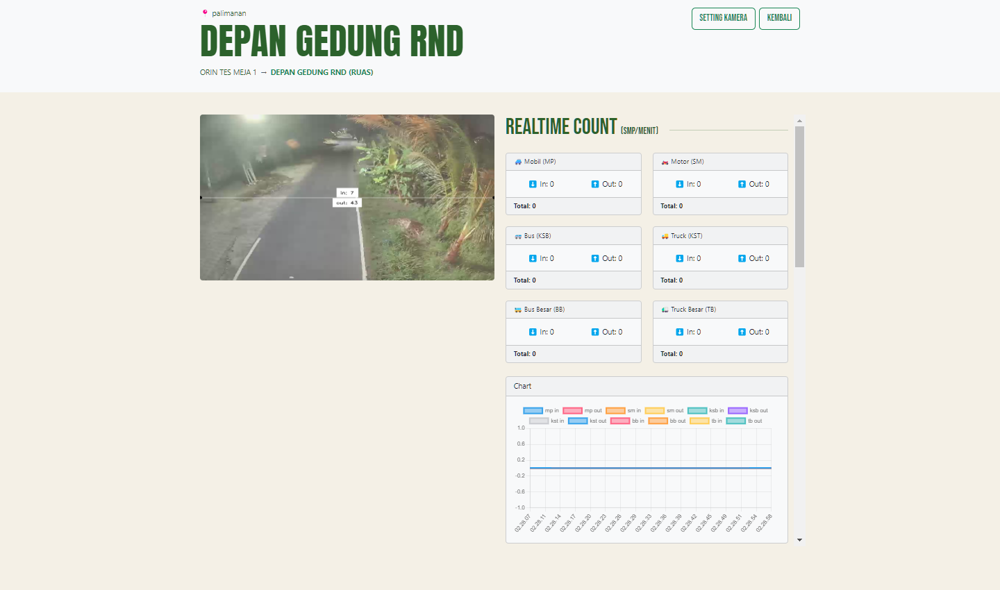
  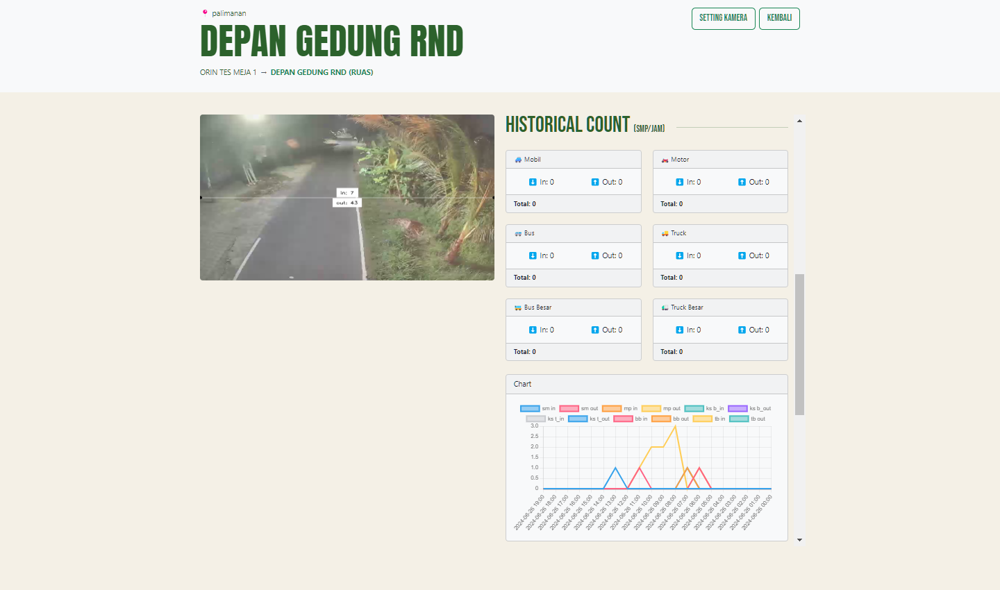
  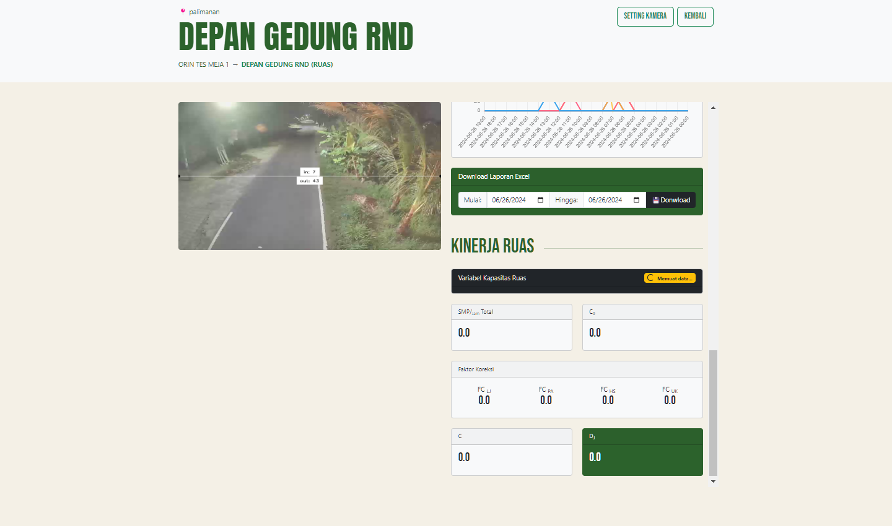
  
### Halaman Chart
- Buka browser di mini PC atau di laptop yang terkoneksi jaringan LAN yang sama dengan mini PC, lalu ketikkan alamat IP mini PC pada browser. `contoh: http://192.168.0.247/`
  
### Unduh Laporan
- Buka browser di mini PC atau di laptop yang terkoneksi jaringan LAN yang sama dengan mini PC, lalu ketikkan alamat IP mini PC pada browser. `contoh: http://192.168.0.247/`
- 

## Mengelola Data

### Mengubah Pengaturan Perangkat
- Buka browser di mini PC atau di laptop yang terkoneksi jaringan LAN yang sama dengan mini PC, lalu ketikkan alamat IP mini PC pada browser. `contoh: http://192.168.0.247/`
- 
### Menghapus Data Perangkat ⚠️
### Mengubah Pengaturan Kamera
- Buka browser di mini PC atau di laptop yang terkoneksi jaringan LAN yang sama dengan mini PC, lalu ketikkan alamat IP mini PC pada browser. `contoh: http://192.168.0.247/`
- 
### Menghapus Data Kamera ⚠️

# Fungsi Tingkat Lanjut

## Melihat Daftar Service Perangkat
- Buka aplikasi terminal pada perangkat mini PC atau akses melalui ssh
- Jalankan perintah berikut lalu tekan tombol `enter`:
  ```[bash]
  cd ~
  ./docker_list.sh
  ```
- Akan muncul tampilan tabel sederhana sebagai berikut:
  
  Berikut keterangan isi dari tabel tersebut:

  | kolom | keterangan |
  |---|---|
  |name|nama service yang berjalan|

## Monitoring Kinerja Perangkat Mini PC Jetson
- Buka aplikasi terminal pada perangkat mini PC atau akses melalui ssh
- Jalankan perintah berikut lalu tekan tombol `enter`:
  ```[bash]
  cd ~
  ./hardware_monitoring.sh
  ```
- Akan muncul tampilan kinerja perangkat mini PC seperti berikut
  
- Tekan tombol `ctrl` dan `c` secara bersamaan untuk menutup tampilan tersebut
## Menghapus Installasi Sistem ⚠️
- Buka aplikasi terminal pada perangkat mini PC atau akses melalui ssh
- Jalankan perintah berikut lalu tekan tombol `enter`:
  ```[bash]
  cd ~
  ./uninstall.sh
  ```
- Tunggu hingga proses uninstall selesai